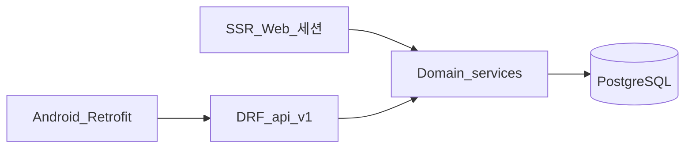

# REST API (확정)

과외 관리 **모바일(Android)·기타 API 클라이언트**용 JSON API 명세입니다.  
**웹**은 기존대로 Django **세션 + SSR**; 본 API는 **DRF**로 **병행(dual)** 합니다.

**확정일**: 2026-05-22

**관련**: [auth.md](./auth.md) (웹 인증), [mobile-android.md](./mobile-android.md), [calendar.md](./calendar.md), [students.md](./students.md), [weekly-lesson-status.md](./weekly-lesson-status.md), [progress-chart.md](./progress-chart.md), [infrastructure.md](./infrastructure.md)

---

## 요약

| 항목 | 결정 |
|------|------|
| 프레임워크 | **Django REST Framework** |
| 버전 prefix | `/api/v1/` |
| 인증 (API) | **JWT** — `djangorestframework-simplejwt` |
| 인증 (웹) | **세션 + CSRF** — 변경 없음 ([auth.md](./auth.md)) |
| 권한 | `IsAuthenticated`; queryset **`owner=request.user`** |
| 시각 | DB·JSON 모두 **UTC ISO 8601** (`Z`); 표시는 클라이언트가 학생 `timezone`으로 변환 |
| 문서화 | drf-spectacular → `/api/schema/` (구현 시, 선택) |

---

## 아키텍처



- **비즈니스 로직**은 `services.py` 등 **한 곳** — 웹 뷰·DRF ViewSet이 동일 함수 호출.
- [calendar.md](./calendar.md)의 `proposed`, `conflicts`, `materialize`는 서비스 레이어 공유.

---

## 베이스 URL

| 환경 | URL |
|------|-----|
| 프로덕션 | `https://{DOMAIN}/api/v1/` |
| 로컬 (`DOMAIN=local`) | `http://127.0.0.1:8080/api/v1/` (Nginx publish 기준) |
| Android 에뮬레이터 | `http://10.0.2.2:8080/api/v1/` (호스트 `127.0.0.1` 매핑) |

- 앱: **build flavor**로 `API_BASE_URL` 주입 (`local` / `prod`).
- **HTTPS** 프로덕션 필수; cleartext는 `local` 디버그만.

---

## 인증 (JWT)

### 토큰 발급

| Method | Path | Body | Response |
|--------|------|------|----------|
| `POST` | `/api/v1/auth/token/` | `{"email","password"}` | `access`, `refresh` |
| `POST` | `/api/v1/auth/token/refresh/` | `{"refresh"}` | `access` |

- 이메일·비밀번호는 [auth.md](./auth.md)와 동일 (`USERNAME_FIELD=email`).
- **미인증 이메일** 계정: `403` + `email_not_verified` 코드 (allauth 정책).
- axes 잠금: `429` + `account_locked`.

### 요청 헤더

```
Authorization: Bearer <access>
Content-Type: application/json
Accept: application/json
```

### 권장 만료 (구현 기본값)

| 토큰 | 만료 |
|------|------|
| Access | 15분 |
| Refresh | 7일 |

- Refresh rotation + blacklist(선택): `POST /api/v1/auth/logout/` body `{"refresh"}`.

### 웹과 분리

| | 웹 | API |
|--|-----|-----|
| 가입·이메일 인증 | allauth HTML | **1차 앱 미포함** — 웹에서 가입 후 앱 로그인 |
| 소셜 | OAuth redirect | **2차** — Custom Tabs + 앱 전용 OAuth |
| MFA | 민감 작업 TOTP | **2차** — API는 1차 MFA 없음 |

---

## 공통 규칙

### 오류 응답

```json
{
  "detail": "Human-readable message",
  "code": "optional_machine_code"
}
```

| HTTP | 용도 |
|------|------|
| 400 | Validation (`field`: `["msg"]`) |
| 401 | 토큰 없음·만료 |
| 403 | 타인 리소스·이메일 미인증 |
| 404 | 없음 |
| 429 | axes 잠금 |

### 페이지네이션

- 기본: **PageNumberPagination**, `page_size=50`, `?page=2`.
- 목록 응답: `{"count","next","previous","results":[...]}`.

### 소유권

- `Student`, `Subject`, `Lesson`, `ScheduleSlot` 등 — **항상** `owner=request.user` 필터.
- 타인 `pk` 접근 → **404** (403 대신 정보 노출 최소화).

---

## 엔드포인트

### 학생 · 과목

| Method | Path | 용도 |
|--------|------|------|
| `GET` | `/api/v1/students/` | 목록 (`?sort=name\|grade`) |
| `POST` | `/api/v1/students/` | 생성 (슬롯·과목 포함은 nested 또는 별도 호출) |
| `GET` | `/api/v1/students/{id}/` | 상세 + `schedule_slots`, `subjects` |
| `PATCH` | `/api/v1/students/{id}/` | 수정 |
| `DELETE` | `/api/v1/students/{id}/` | 삭제 (선택 구현) |
| `GET` | `/api/v1/subjects/` | 과목 마스터 |
| `POST` | `/api/v1/subjects/` | 과목 추가 |
| `GET` | `/api/v1/students/{id}/detail/` | `StudentDetail` + `goal_history` |
| `PATCH` | `/api/v1/students/{id}/detail/` | `long_memo`, 이력 CRUD는 nested |

**`Student` JSON (요약)** — 필드 전체는 [students.md](./students.md).

```json
{
  "id": 1,
  "name": "김○",
  "birth_year": 2010,
  "age": 16,
  "grade": "중2",
  "country": "KR",
  "city": "서울",
  "timezone": "Asia/Seoul",
  "student_contact": "",
  "parent_name": "",
  "parent_contact": "",
  "subject_ids": [1, 2],
  "hourly_rate": "50000.00",
  "lesson_duration_minutes": 60,
  "lessons_completed": 2,
  "next_lesson_number": 3,
  "schedule_slots": [
    {"id": 1, "day_of_week": 1, "start_time": "19:00", "end_time": "20:30", "note": ""}
  ]
}
```

---

### 달력 · 수업

| Method | Path | 용도 |
|--------|------|------|
| `GET` | `/api/v1/calendar/events/` | Lesson + proposed + conflicts |
| `POST` | `/api/v1/lessons/` | 제안 승인 → `Lesson` 생성 |
| `POST` | `/api/v1/lessons/{id}/complete/` | 완료 + `lessons_completed` |
| `POST` | `/api/v1/lessons/{id}/cancel/` | 취소 ([weekly-lesson-status.md](./weekly-lesson-status.md)) |
| `POST` | `/api/v1/proposals/dismiss/` | 제안 ✗ |
| `PATCH` | `/api/v1/lessons/{id}/` | 일정·메모·취소 필드·`lesson_kind` 등 |

**Query — `GET /api/v1/calendar/events/`**

| Param | 필수 | 설명 |
|-------|------|------|
| `start` | O | 구간 시작 ISO date 또는 datetime (UTC) |
| `end` | O | 구간 끝 |

**Response (개념)**

```json
{
  "events": [
    {
      "id": "lesson-42",
      "type": "lesson",
      "student_id": 1,
      "student_name": "김○",
      "title": "김○",
      "subtitle": "3회차 · 60분",
      "start": "2026-03-18T10:00:00Z",
      "end": "2026-03-18T11:00:00Z",
      "date": "2026-03-18",
      "lesson_number": 3,
      "status": "scheduled",
      "ui_state": "upcoming",
      "proposed": false,
      "duration_minutes": 60,
      "lesson_kind": "regular",
      "course_name": ""
    },
    {
      "id": "proposal-5-2026-03-20",
      "type": "proposal",
      "schedule_slot_id": 5,
      "student_id": 1,
      "student_name": "김○",
      "title": "김○",
      "subtitle": "4회차 · 60분",
      "start": "2026-03-20T10:00:00Z",
      "end": "2026-03-20T11:00:00Z",
      "proposed": true,
      "ui_state": "proposed"
    }
  ],
  "conflicts": [
    {"event_ids": ["lesson-42", "lesson-43"], "message": "겹치는 수업"}
  ]
}
```

**`ui_state` 값** (서버 계산, [calendar.md](./calendar.md)): `upcoming` | `in_progress` | `past_incomplete` | `completed` | `cancelled` | `proposed`

**`POST /api/v1/lessons/{id}/complete/`** — 응답에 갱신된 `lessons_completed` 포함 권장.

**`POST /api/v1/lessons/{id}/cancel/`** body 예:

```json
{
  "cancelled_by": "student",
  "cancel_reason": "",
  "makeup_status": "undecided",
  "makeup_date": null
}
```

**`POST /api/v1/proposals/dismiss/`** body: `{"schedule_slot_id": 5, "date": "2026-03-20"}`

---

### 주간 수업 현황

| Method | Path | 용도 |
|--------|------|------|
| `GET` | `/api/v1/reports/weekly/` | ISO 주차 리포트 JSON |

**Query**

| Param | 설명 |
|-------|------|
| `year` | **ISO 연도** (`iso_year`) |
| `week` | **ISO 주차** (`iso_week`) |

- 주차 규칙: [weekly-lesson-status.md](./weekly-lesson-status.md) — `isocalendar`, 월~일 구간.

**Response `results[]` 행 예**

```json
{
  "seq": 1,
  "date": "03.18",
  "weekday": "화",
  "time": "19:00~20:00",
  "time_highlight": false,
  "course_name": "고1 통합과학",
  "lesson_kind_display": "정규",
  "student_name": "김○",
  "grade": "중2",
  "remarks": "—",
  "status": "completed"
}
```

- `cancelled`: `date`, `weekday`, `time` → `null`; `remarks`는 서버 포맷터(특이사항 템플릿).
- `time_highlight`: 60분 ≠ 수업 길이.

**`GET /api/v1/reports/weekly/weeks/`** (권장) — 연도별 주차 셀렉트 옵션

```json
{"year": 2026, "weeks": [{"week": 12, "label": "12주차 (03.17~03.23)", "week_start": "2026-03-17", "week_end": "2026-03-23"}]}
```

---

### 진도차트 (2차 앱)

| Method | Path | 용도 |
|--------|------|------|
| `GET` | `/api/v1/students/{id}/lessons/` | 완료 수업 목록 (`lesson_content`, `lesson_notes`) |
| `PATCH` | `/api/v1/lessons/{id}/` | 내용·비고 저장 |

- 웹 HTML: `/students/<id>/progress/` — [progress-chart.md](./progress-chart.md).

---

## Django 구현 (구조)

```
config/
  settings.py          # REST_FRAMEWORK, SIMPLE_JWT
  urls.py              # path("api/v1/", include("api.urls"))
api/
  urls.py
  auth.py              # TokenObtainPairView, refresh
  permissions.py       # OwnerFilterMixin
  serializers/
  viewsets/
students/services/     # 기존 도메인 — DRF에서 import
calendar/services.py
```

**패키지 (requirements)**

```
djangorestframework
djangorestframework-simplejwt
django-cors-headers    # local 디버그만 ALLOW (선택)
```

### CORS

| 환경 | 정책 |
|------|------|
| 프로덕션 | **CORS 불필요** (네이티브 앱은 Origin 없음) |
| `DOMAIN=local` | `CORS_ALLOWED_ORIGINS`에 `http://localhost:*` — **웹 SPA 디버그용만** |

---

## 웹 JSON 경로 정리

[calendar.md](./calendar.md) 등에 `/api/calendar/...` 로 적힌 경로는 구현 시 **`/api/v1/...`** 로 통일한다.

| 문서 (구 표기) | 확정 경로 |
|----------------|-----------|
| `/api/calendar/events/` | `/api/v1/calendar/events/` |
| `/api/lessons/` | `/api/v1/lessons/` |
| `/api/proposals/dismiss/` | `/api/v1/proposals/dismiss/` |

---

## 구현 체크리스트

- [ ] DRF + simplejwt 설정
- [ ] `api` 앱·`OwnerFilterMixin`
- [ ] Auth token·refresh·(logout blacklist)
- [ ] Students / Subjects ViewSet
- [ ] Calendar events + lesson actions (complete, cancel, dismiss)
- [ ] Weekly report + weeks metadata
- [ ] 서비스 레이어와 웹 뷰 공유 테스트
- [ ] (2차) 진도차트 lessons list

---

## 추후 (범위 외)

- 소셜 로그인 API (`/api/v1/auth/social/...`)
- MFA step-up 토큰
- WebSocket / push (수업 리마인더)
- API rate limit (axes 연동)
