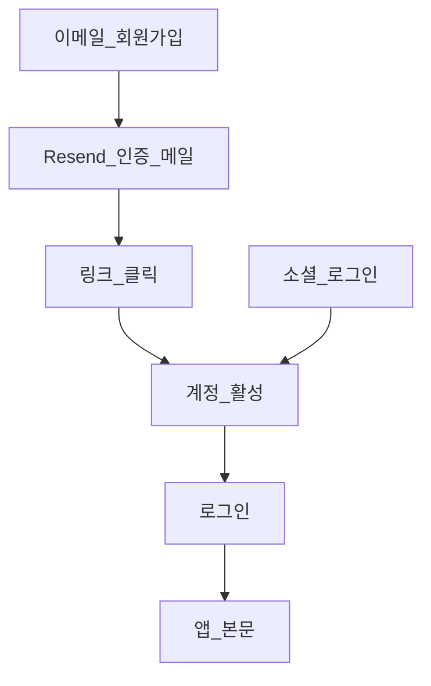
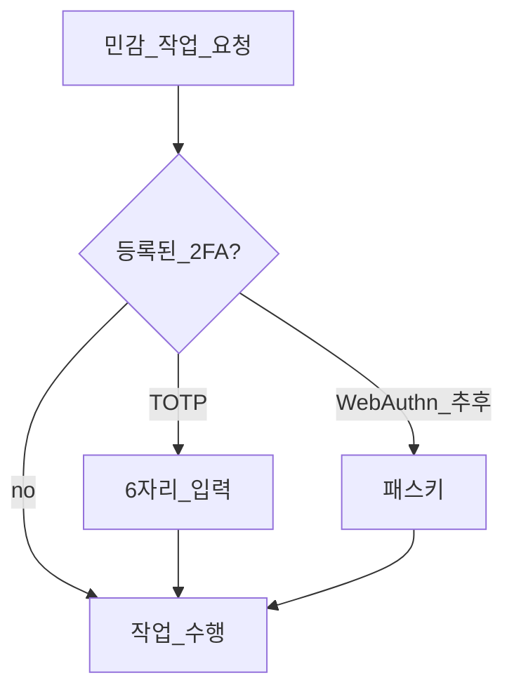

# 인증·회원가입 (확정)

과외 관리 **웹** 회원가입·로그인·2단계 인증 명세입니다. **Android**는 [api.md](./api.md) JWT — 본 문서와 **병행(dual)**.  
**확정일**: 2026-05-22

**관련 문서**

- 인프라·`DOMAIN`·HTTPS: [infrastructure.md](./infrastructure.md)
- Resend DNS·스팸 (배포 시): [email-deliverability.md](./email-deliverability.md)
- 모바일·REST API: [api.md](./api.md), [mobile-android.md](./mobile-android.md)

---

## 요약

| 항목 | 결정 |
|------|------|
| 프레임워크 | Django **세션 + CSRF** (웹 SSR) |
| 모바일 인증 | **JWT** — [api.md](./api.md); 로그인 시 MFA 없음 (1차) |
| 계정 | **django-allauth** |
| 가입 | **공개 회원가입**, **이메일 인증 필수** |
| 로그인 ID | **이메일만** (커스텀 User, `USERNAME_FIELD=email`) |
| 소셜 | **Google, GitHub, 네이버** (OAuth, 무료) |
| 인증 메일 | **Resend** + django-anymail (운영) / console·Mailpit (개발) |
| 로그인 시 MFA | **없음** |
| 2FA | **TOTP** — **민감 작업** 직전만; **WebAuthn**은 확장 자리만 (1차 미구현) |
| 보조 | django-axes, Argon2, secure 쿠키 (HTTPS 시) |

---

## 스택

```
django-allauth
django-anymail[resend]
django-otp
django-axes
```

| 패키지 | 역할 |
|--------|------|
| allauth | 가입·로그인·이메일 인증·소셜·비밀번호 재설정 |
| anymail | 프로덕션 메일 → Resend API |
| django-otp | TOTP 디바이스·검증 |
| axes | 로그인 실패 잠금 |

---

## 사용자·가입

| 설정 | 값 |
|------|-----|
| `ACCOUNT_OPEN_SIGNUP` | `True` |
| `ACCOUNT_AUTHENTICATION_METHOD` | `email` |
| `ACCOUNT_EMAIL_VERIFICATION` | `mandatory` |
| `ACCOUNT_USERNAME_REQUIRED` | `False` |
| User 모델 | `accounts.User` — `email` unique, `USERNAME_FIELD = "email"` |

### 플로우



- 미로그인: 학생·관리 URL → `LoginRequiredMixin` / `@login_required`
- 로그인 후: `LOGIN_REDIRECT_URL` → **홈 달력** (`/`) — [calendar.md](./calendar.md)

---

## 소셜 로그인

| Provider | 비용 | 등록 |
|----------|------|------|
| Google | 무료 | Google Cloud OAuth 클라이언트 |
| GitHub | 무료 | GitHub OAuth App |
| Naver | 무료 | 네이버 개발자센터 |

- 콜백 URL: `https://{DOMAIN}/accounts/{provider}/login/callback/` (로컬은 `http://127.0.0.1:8080/...`)
- OAuth client id/secret: **web 컨테이너 env** (호스트 `export` 아님)
- 동일 이메일이면 allauth **계정 자동 연동**; UI에서 소셜 연결·해제 제공

### 이메일 없는 소셜 계정

provider가 이메일을 주지 않으면 **가입·연동 시 이메일 추가 입력**을 요구한다 (비밀번호 재설정·Resend와 일관).

---

## 인증 메일 (Resend)

### 환경별 백엔드

| 환경 | 조건 | `EMAIL_BACKEND` |
|------|------|-----------------|
| 개발 | `DOMAIN` 공란 또는 `local` | `django.core.mail.backends.console.EmailBackend` 또는 Mailpit SMTP |
| 운영 | 그 외 공개 `DOMAIN` | `anymail.backends.resend.EmailBackend` |

`settings`에서 `DOMAIN`·`DEBUG`로 분기한다.

### 컨테이너 env (web)

| 변수 | 운영 | 개발 |
|------|------|------|
| `RESEND_API_KEY` | 필수 | 생략 가능 |
| `DEFAULT_FROM_EMAIL` | `noreply@{DOMAIN}` | `noreply@localhost` 등 |
| `SERVER_EMAIL` | `DEFAULT_FROM_EMAIL`과 동일 권장 | — |

### 발송 종류 (allauth)

- 가입 **이메일 인증**
- **비밀번호 재설정**
- (allauth 기본) 이메일 변경 확인

### 배포 시 도달률

SPF·DKIM·DMARC·스모크 테스트 → **[email-deliverability.md](./email-deliverability.md)** (배포 단계에서만 수행).

---

## 보안 (로그인·세션)

| 항목 | 구현 |
|------|------|
| 비밀번호 해시 | **Argon2** (`PASSWORD_HASHERS`) |
| 비밀번호 정책 | Django `AUTH_PASSWORD_VALIDATORS` |
| 브루트포스 | **django-axes** |
| 쿠키 | `SESSION_COOKIE_SECURE`, `CSRF_COOKIE_SECURE` — HTTPS·공개 `DOMAIN` 시 True ([infrastructure.md](./infrastructure.md)) |
| CSRF | Django 기본 + `CSRF_TRUSTED_ORIGINS` |

---

## 2단계 인증 (MFA)

### 정책

| 시점 | TOTP | WebAuthn |
|------|------|----------|
| **로그인** | 요구 안 함 | 요구 안 함 |
| **민감 작업** | 등록된 경우 **재인증** | 추후 동일 인터페이스 |

### 민감 작업 (TOTP 재확인 대상)

1. 비밀번호 변경  
2. TOTP(2FA) **활성화·비활성화**  
3. 이메일 주소 변경  
4. 계정 삭제 (구현 시)

2FA 미등록 사용자는 비밀번호(또는 소셜 세션)만으로 민감 작업 가능 — 단, **2FA 켜기** 직전에는 TOTP 등록 플로우만 별도.

### TOTP

- **django-otp** `TOTPDevice`
- 등록: 계정 설정 → QR → 확인 코드 1회
- **백업 코드** 8~10개, 1회용 — 등록 시 표시·저장 권장 (분실 복구)
- 분실 시: 백업 코드 또는 (추후) 이메일 기반 MFA 초기화 — 운영 정책은 구현 시 UI에 명시

### WebAuthn (확장만)

1차는 **구현하지 않음**. 아래만 준비한다.

```python
# accounts/security.py (개념)
class SecondFactorBackend(Protocol):
    def verify(request, user) -> bool: ...

class TotpBackend(SecondFactorBackend): ...       # 1차
class WebAuthnBackend(SecondFactorBackend): ...  # NotImplementedError / 추후
```

- `SensitiveActionMixin` 또는 데코레이터가 등록된 백엔드 순으로 `verify` 호출
- 설정: `WEBAUTHN_ENABLED = False` (추후 True)

### 민감 작업 플로우



---

## URL·앱 구조 (구현 시)

| 경로 | 제공 |
|------|------|
| `/accounts/` | allauth (login, signup, logout, password reset, social) |
| `/accounts/2fa/` | TOTP 설정·민감 작업 재인증 (커스텀) |
| `accounts` 앱 | `User`, `security.py`, 2FA 뷰 |

---

## 환경 변수 (.env.example 항목)

```bash
# --- Auth / Email (web 컨테이너) ---
SECRET_KEY=change-me

# Resend (운영, DOMAIN이 public일 때)
RESEND_API_KEY=re_xxxx
DEFAULT_FROM_EMAIL=noreply@your-domain.com

# OAuth (운영·개발 각 앱 등록)
GOOGLE_CLIENT_ID=
GOOGLE_CLIENT_SECRET=
GITHUB_CLIENT_ID=
GITHUB_CLIENT_SECRET=
NAVER_CLIENT_ID=
NAVER_CLIENT_SECRET=

# DOMAIN → infrastructure.md
DOMAIN=local
```

Postgres·`DB_*` 등은 [infrastructure.md](./infrastructure.md).

---

## 구현 체크리스트

- [ ] 커스텀 `User` + allauth 설정
- [ ] Google / GitHub / Naver provider + env
- [ ] Resend anymail + dev/prod `EMAIL_BACKEND` 분기
- [ ] axes, Argon2, `LoginRequired` 전역 적용
- [ ] TOTP 등록·민감 작업 `SensitiveActionMixin`
- [ ] `SecondFactorBackend` + `WebAuthnBackend` 스텁
- [ ] 백업 코드 생성·검증
- [ ] 배포 시 [email-deliverability.md](./email-deliverability.md)

---

## 미구현

앱 코드·compose는 [infrastructure.md](./infrastructure.md) 및 본 문서를 기준으로 이후 단계에서 작성한다.
