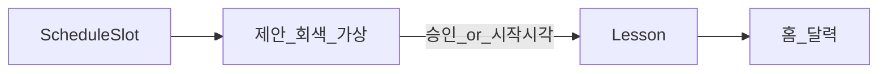

# 홈 달력·수업 일정 (확정)

로그인 후 **홈** 화면의 달력·수업 인스턴스·상태·제안·충돌·DnD 명세입니다.  
**확정일**: 2026-05-22

**관련**: [students.md](./students.md), [auth.md](./auth.md), [progress-chart.md](./progress-chart.md), [weekly-lesson-status.md](./weekly-lesson-status.md), [api.md](./api.md), [mobile-android.md](./mobile-android.md)

---

## 요약

| 항목 | 결정 |
|------|------|
| 홈 | **달력** (`LOGIN_REDIRECT_URL` → `/` 또는 `/home/`) |
| 뷰 | **월간** 기본 + **주간** 탭 (24시간 time grid) |
| 월간 표시 | **제목**=학생 이름; **부제**(작은 회색)=`N회차 · M분` |
| 주간 표시 | 블록 높이=수업 길이; **이름 + 회차**만 |
| 클릭 | **학생 상세** (`/students/<id>/`) |
| DB | `ScheduleSlot`(템플릿) ≠ `Lesson`(실제 1회); 미래 **미리 INSERT 안 함** |
| 제안 | `ScheduleSlot` 기반 **가상** — 흐린 회색; hover **✓** / **✗** |
| 거절 | `LessonProposalDismissal` — 해당 **날짜·슬롯**만 재제안 안 함 |
| 자동 생성 | ✓ 승인 또는 **시작 시각** 도래 시 `Lesson` 생성 |
| 상태 4종 | 예정 / 수업중 / 지남·미완료 / 지남·완료 (+ 제안=회색) |
| 겹침 | 블록 **겹쳐 표시** + 교차부 **붉은 ‼** + 툴팁 |
| 완료 | 완료 버튼 → `Lesson.completed` + `Student.lessons_completed += 1` |
| DnD | **`Lesson`만**; 월=날짜, 주=날짜+시간; 완료 수업 잠금; `ScheduleSlot` 불변 |
| 종료 시각 | `end = start + student.lesson_duration_minutes` (**B**) |

---

## 개념



| 개념 | DB | 정규 시간 변경 시 |
|------|-----|-------------------|
| `ScheduleSlot` | O | 슬롯만 수정 → **제안 일정 재계산** |
| 제안 | X (계산 + Dismissal) | Dismissal·슬롯 반영 |
| `Lesson` | O | 개별 이월·완료·DnD |

---

## 모델

### `Lesson`

| 필드 | 타입 | 비고 |
|------|------|------|
| `student` | FK → `Student` | |
| `schedule_slot` | FK → `ScheduleSlot`, null | 제안·승인 출처 |
| `date` | `DateField` | 학생 `timezone` 기준 날짜 |
| `start_datetime` | `DateTimeField` | TZ-aware (UTC 저장) |
| `end_datetime` | `DateTimeField` | `start + lesson_duration_minutes` |
| `lesson_number` | `PositiveIntegerField` | 생성 시점 `lessons_completed + 1` (고정) |
| `status` | `scheduled` / `completed` / `cancelled` | 취소 → [weekly-lesson-status.md](./weekly-lesson-status.md) |
| `completed_at` | `DateTimeField`, null | |
| `lesson_content` | `TextField`, blank | [progress-chart.md](./progress-chart.md) |
| `lesson_notes` | `TextField`, blank | 비고 |
| `lesson_kind` | `regular` / `test` | 테스트/정규 |
| `course_name` | `CharField`, blank | 과정명 |
| `cancelled_by` | `student` / `teacher`, null | 취소 주체 |
| `cancel_reason` | `CharField`, blank | 취소 사유 |
| `makeup_status` | `undecided` / `no_makeup` / `scheduled` | 보강 여부 |
| `makeup_date` | `DateField`, null | 보강 예정일 (`scheduled` 시) |

### `LessonProposalDismissal`

| 필드 | 비고 |
|------|------|
| `schedule_slot`, `date`, `owner` | `unique_together (schedule_slot, date)` |

### UI 상태 (색)

| 상태 | 조건 |
|------|------|
| 수업 예정됨 | `now < start`, 미완료 |
| 수업중 | `start <= now < end`, 미완료 |
| 수업시간 지남 | `now >= end`, 미완료 |
| 수업시간 지남 (완료) | `status == completed` |
| **취소** | `status == cancelled` (달력: 취소 스타일) |
| 제안 | `proposed: true`, 흐린 회색 |

카드 **테두리·배경 tint**로 상태 구분 (겹침과 별도).

---

## 제안 (흐린 회색)

1. 표시 구간(월/주) 각 날짜 × `ScheduleSlot.day_of_week` 일치  
2. `LessonProposalDismissal` 없음  
3. 동일 슬롯·날짜에 `Lesson` 없음  
4. → 가상 이벤트 (`proposed: true`)

| Hover | 동작 |
|-------|------|
| ✓ | `Lesson` 생성 |
| ✗ | `LessonProposalDismissal` |

**자동 생성**: 달력 로드·주기 poll 시 `start <= now`인 제안 → `Lesson` (✗ 날짜 제외).

**회차(제안 표시)**: `lessons_completed + 1` ([students.md](./students.md)).

---

## 뷰별 표시

### 월간

| 영역 | 스타일 | 내용 |
|------|--------|------|
| 제목 | 상태 색 tint | `{student.name}` |
| 부제 | 작은 **회색** | `{lesson_number}회차 · {duration}분` |

### 주간

- **00:00–24:00** 축, 30분/1시간 눈금  
- `start`–`end` **세로 블록**  
- 텍스트: **이름 + 회차** (분 수 없음)  
- 제안: 흐린 회색, 동일 ✓/✗

---

## 겹침·충돌

- 겹치는 이벤트: **z-index 겹침** (폭 줄이지 않음)  
- 교차 영역: **붉은 ‼** (또는 `alert-circle`)  
- 툴팁: 「시간이 겹칩니다」+ 학생 이름  
- 생성·DnD·승인 **차단 안 함**

API: `conflicts[]` in calendar events response.

---

## 완료 버튼

- 팝오버/이벤트 클릭 UI — **완료** + **수업 내용**·**비고** 편집 ([progress-chart.md](./progress-chart.md))  
- `status=completed`, `completed_at=now`  
- **`Student.lessons_completed += 1`** (해당 `Lesson`에 아직 반영 안 됐을 때만 — 중복 방지)

---

## 드래그 앤 드롭

| 대상 | `Lesson`만 (제안·완료 수업 제외) |
|------|----------------------------------|
| 월간 | 날짜만 변경, 시각 유지 |
| 주간 | 날짜 + 시간 변경 |
| 규칙 | 길이 유지; `ScheduleSlot` 불변; PATCH API |

---

## 화면·API

| URL | 설명 |
|-----|------|
| `/`, `/home/` | 홈 달력 |
| `/students/<id>/` | 셀 클릭 |

```
calendar/                 # 또는 students/services
  models.py               # Lesson, LessonProposalDismissal
  services.py             # proposed, conflicts, materialize
  views.py                # home, API
```

| API | 용도 |
|-----|------|
| `GET /api/v1/calendar/events/` | Lesson + proposed + conflicts — [api.md](./api.md) |
| `POST /api/v1/lessons/` | 제안 승인 |
| `POST /api/v1/lessons/<id>/complete/` | 완료 |
| `POST /api/v1/proposals/dismiss/` | ✗ |
| `PATCH /api/v1/lessons/<id>/` | DnD, `lesson_content`, `lesson_notes` |

**프론트**: FullCalendar — `dayGridMonth`, `timeGridWeek`, `eventContent`, `editable`, conflict overlay.

---

## 구현 체크리스트

- [ ] `Lesson`, `LessonProposalDismissal`
- [ ] proposed·conflicts·materialize 서비스
- [ ] 홈 월간/주간 + API
- [ ] ✓/✗ hover
- [ ] 상태 색·완료 버튼
- [ ] DnD + 겹침 ‼
- [ ] `lessons_completed` 동기화

---

## 추후 (범위 외)

- 취소·연기·보강 전용 UI  
- Celery 기반 자동 materialize  
- 제안 드래그로 다른 날 승인
