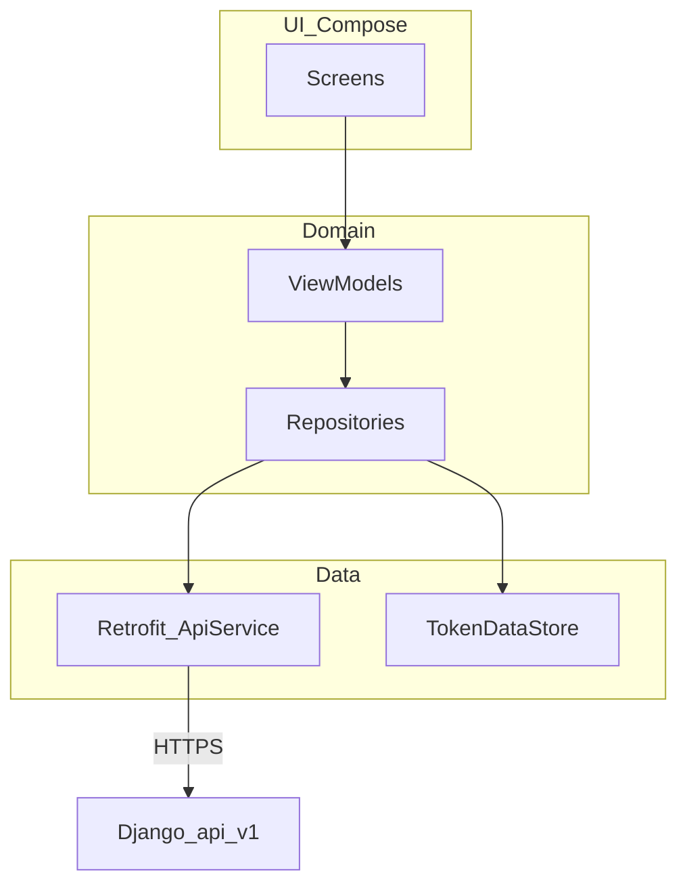
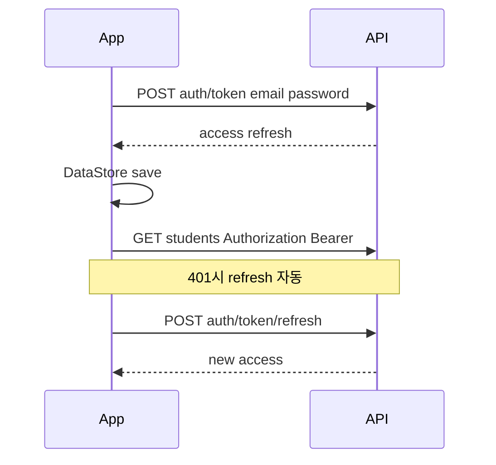
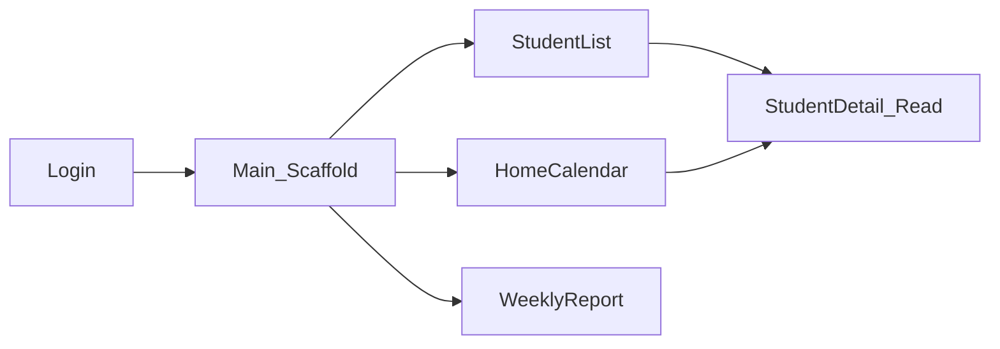

# Android 앱 (확정)

과외 관리 **Android 클라이언트** 명세입니다. 백엔드 JSON API는 [api.md](./api.md)를 따릅니다.

**확정일**: 2026-05-22

**관련**: [api.md](./api.md), [auth.md](./auth.md), [calendar.md](./calendar.md), [students.md](./students.md), [weekly-lesson-status.md](./weekly-lesson-status.md)

---

## 요약

| 항목 | 결정 |
|------|------|
| 플랫폼 | **Android** (1차); iOS는 **별도** (추후) |
| 언어·UI | **Kotlin**, **Jetpack Compose**, **Material 3** |
| 아키텍처 | **MVVM** + Repository, `StateFlow` / `UiState` |
| API | [api.md](./api.md) — Retrofit + JWT |
| 저장소 위치 | 모노레포 **`android/`** (루트) |
| 인증 1차 | **이메일·비밀번호** → JWT |
| 범위 외 1차 | 소셜, MFA, DnD, 제안 ✓/✗, 진도차트 편집, 학생 삭제 |

---

## 아키텍처



| 레이어 | 책임 |
|--------|------|
| **Screen** | Compose UI, 이벤트 → ViewModel |
| **ViewModel** | `UiState`, coroutine, Repository 호출 |
| **Repository** | API + 캐시 정책; 토큰 갱신은 **Interceptor** |
| **ApiService** | Retrofit 인터페이스 ([api.md](./api.md) 경로) |

---

## 기술 스택

| 영역 | 라이브러리 |
|------|------------|
| UI | Jetpack Compose, Material3, Navigation Compose |
| 비동기 | Kotlin Coroutines, Flow |
| DI | **Hilt** (권장) 또는 Koin |
| HTTP | Retrofit 2, OkHttp, Logging Interceptor |
| JSON | **kotlinx.serialization** (권장) 또는 Moshi |
| 토큰 | **DataStore Preferences** (access/refresh) |
| 날짜·TZ | `java.time` + **학생 `timezone`** (`ZoneId`) — API UTC 파싱 후 변환 |
| 달력 UI | **커스텀 Compose** (월 그리드 + 주간 time column); 1차는 서드파티 최소 |

**최소 SDK**: 26 (Android 8.0)  
**targetSdk**: 최신 stable (구현 시점 기준 34+)

---

## 빌드·환경

| Flavor | `API_BASE_URL` |
|--------|----------------|
| `localDebug` | `http://10.0.2.2:8080/api/v1/` (에뮬레이터) |
| `deviceLocal` | 개발 PC LAN IP (실기기 USB 디버그) |
| `release` | `https://{DOMAIN}/api/v1/` |

- `network_security_config`: **release는 cleartext 금지**; debug만 `10.0.2.2` 허용.
- 앱 패키지명 예: `com.tutoring.manager` (구현 시 확정).

---

## 인증 플로우



| 단계 | 동작 |
|------|------|
| 로그인 | [api.md](./api.md) `POST /auth/token/` |
| 저장 | `TokenDataStore` — refresh는 **Encrypted** 권장 (EncryptedSharedPreferences 또는 DataStore + Android Keystore) |
| API 호출 | OkHttp `Authenticator` 또는 Interceptor — 401 → refresh → 재시도 1회 |
| 로그아웃 | 토큰 삭제 + (선택) `POST /auth/logout/` |
| 가입 | **앱 미제공** — 「웹에서 가입」안내 + 브라우저 Custom Tabs (`/accounts/signup/`) |
| 소셜 | **2차** |

---

## 화면·네비게이션 (1차 MVP)



| 화면 | Route | 기능 |
|------|-------|------|
| **로그인** | `login` | 이메일·비밀번호, 오류 표시, 토큰 저장 |
| **학생 목록** | `students` | `GET /students/`, 이름·학년·슬롯 요약, 탭 정렬 |
| **학생 상세** | `students/{id}` | 읽기 중심 + 연락처; **편집 2차** |
| **홈 달력** | `calendar` | 월간 기본 / 주간 탭; `GET /calendar/events/` |
| **수업 상세 시트** | bottom sheet | 완료 버튼, 취소 **2차**; 1차는 **완료만** |
| **주간 수업 현황** | `reports/weekly` | 연도·주차 선택, `GET /reports/weekly/` 테이블 |

**BottomNavigation (예)**: 달력 · 학생 · 주간현황

---

## 달력 (1차)

[calendar.md](./calendar.md) 동작을 앱에 맞게 단계 적용.

| 기능 | 1차 MVP | 2차 |
|------|---------|-----|
| 월간·주간 뷰 | O | |
| Lesson 색·상태 (`ui_state`) | O | |
| proposed 회색 표시 | O (읽기) | |
| ✓ 승인 / ✗ 거절 | | O |
| 겹침 ‼ 표시 | O (간단 badge) | |
| DnD | | O |
| 완료 → `lessons_completed` | O | |
| 취소 입력 | | O |

- **클릭**: 학생 상세로 이동 (`student_id`).
- 시간 표시: `ZonedDateTime` with `student.timezone` from event or nested student.

---

## 주간 수업 현황 (1차)

- [weekly-lesson-status.md](./weekly-lesson-status.md) — ISO 주차, 서버 포맷 `remarks`·`time_highlight` 그대로 표시.
- 연도·주차: `GET /reports/weekly/weeks/?year=2026` 로 드롭다운 채움.
- `LazyColumn` + `HorizontalScroll` 테이블 (컬럼 많을 때).

---

## 프로젝트 구조 (권장)

```
android/
  app/
    src/main/java/.../tutoring/
      MainActivity.kt
      TutoringApp.kt          # @HiltAndroidApp
      di/                     # NetworkModule, RepositoryModule
      data/
        api/ApiService.kt
        api/AuthInterceptor.kt
        datastore/TokenStore.kt
        dto/                  # kotlinx.serialization models
        repository/
      ui/
        login/
        students/
        calendar/
        weekly/
        theme/
      navigation/NavGraph.kt
  build.gradle.kts
```

---

## 패키지·모듈 (구현 시)

| Gradle | 내용 |
|--------|------|
| `com.android.application` | 단일 `app` 모듈 (1차) |
| Compose BOM | UI 버전 정렬 |
| Hilt | `kapt` / KSP |
| Retrofit + serialization converter | |

---

## 오프라인·동기화

| 항목 | 1차 |
|------|-----|
| 오프라인 | **미지원** — 네트워크 필요 시 안내 |
| Room 캐시 | **2차** 검토 |
| Pull-to-refresh | 목록·달력·주간 **권장** |

---

## 테스트

| 종류 | 도구 |
|------|------|
| Unit | ViewModel + Repository (MockWebServer) |
| UI | Compose UI Test — 로그인·목록 스모크 |

---

## 구현 체크리스트

- [ ] `android/` 모듈 스캐폴딩 (Compose, Hilt, flavors)
- [ ] TokenStore + AuthInterceptor + Login
- [ ] Student list / detail (read)
- [ ] Calendar month/week + events API
- [ ] Lesson complete action
- [ ] Weekly report + week picker
- [ ] (2차) Proposal approve/dismiss, cancel, student edit, progress chart

---

## 추후 (범위 외)

- 소셜 로그인 (Custom Tabs + deep link)
- Push 알림 (수업 30분 전)
- 위젯·Wear
- iOS (Swift — **코드베이스 별도**)
