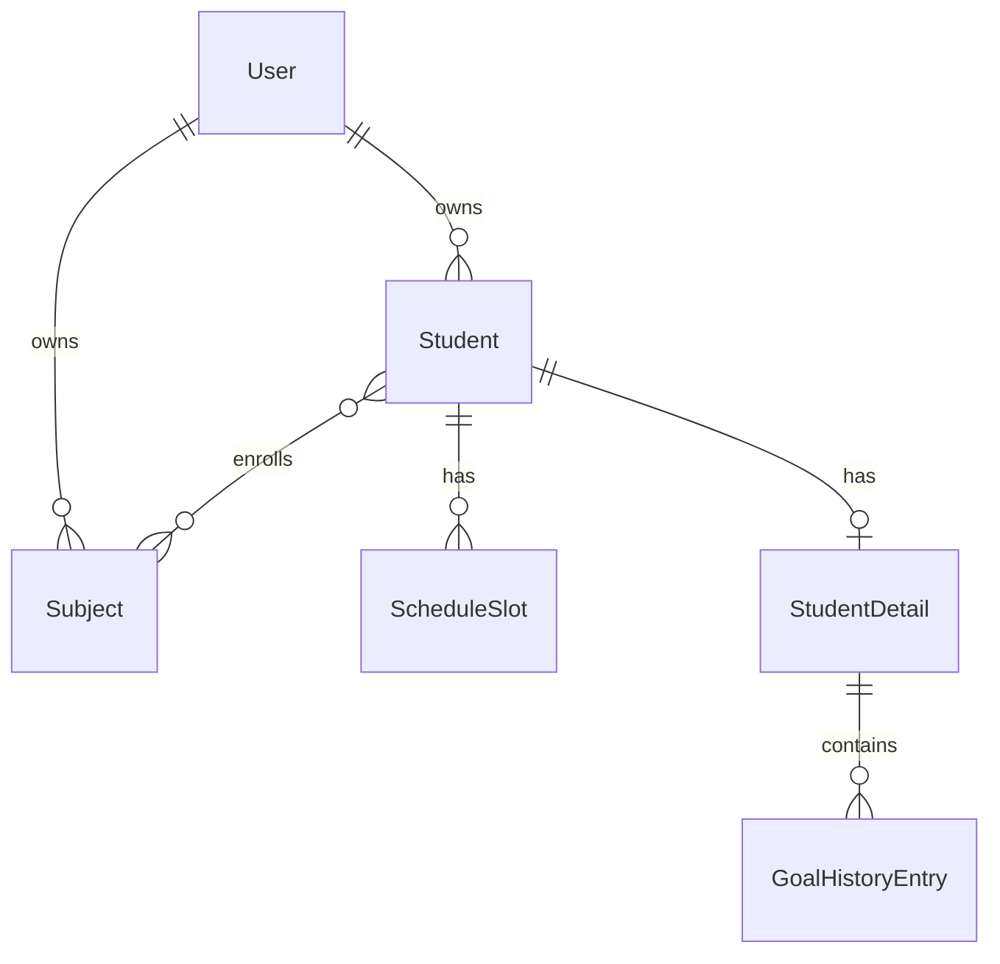
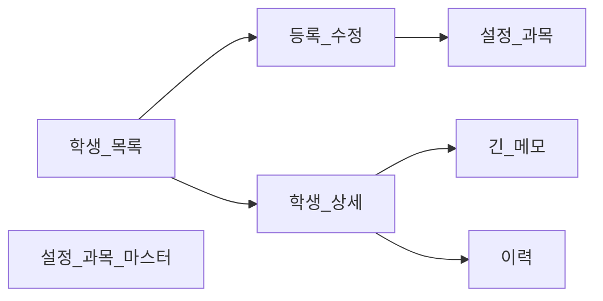

# 학생 정보 (확정)

과외 관리 웹앱(`tutoring-manager`)의 학생·과목·수업 시간표·상세 메모·이력 명세입니다.  
**확정일**: 2026-05-22

**관련**: [auth.md](./auth.md), [infrastructure.md](./infrastructure.md), [calendar.md](./calendar.md), [progress-chart.md](./progress-chart.md), [api.md](./api.md), [mobile-android.md](./mobile-android.md)

---

## 요약

| 항목 | 결정 |
|------|------|
| 소유권 | `Student`·`Subject` → `owner` = 로그인 User, **본인 데이터만** |
| 목록 vs 상세 | 목록·폼 필드 + `StudentDetail`(메모·이력) |
| 첨부 | **미구현** |
| 과목 | `Subject` 마스터 + M2M; **학생 폼**·**설정 › 과목** 둘 다 |
| 정규 수업 | `ScheduleSlot` — 요일별 반복, 복수 슬롯 |
| 목록 정렬 | **이름**, **학년** |
| 회차 | `lessons_completed`만 저장; **다음 회차 = completed + 1** (표시만) |

---

## ER 개요



---

## 모델

### `Student`

| 필드 | 타입 | UI 라벨·비고 |
|------|------|----------------|
| `owner` | FK → `User` | 자동 (요청 사용자) |
| `name` | `CharField` | 이름 **필수** |
| `birth_year` | `PositiveIntegerField` | 생년; **나이** = 올해 − 생년 (`@property age`, DB 없음) |
| `grade` | `CharField(max_length=32)` | 학년 — **자유 입력** + 드롭다운 제안(초1~6, 중1~3, 고1~3, N수, 성인, 기타) |
| `country` | `CharField` | 국가 (예: KR, US) |
| `city` | `CharField` | 도시 |
| `timezone` | `CharField` | **IANA** (예: `Asia/Seoul`); 국가·도시 → 자동 제안, 수동 수정 |
| `student_contact` | `CharField` | 학생 연락처 |
| `parent_name` | `CharField` | 학부모 이름 |
| `parent_contact` | `CharField` | 학부모 연락처 |
| `subjects` | M2M → `Subject` | 수강 과목 (복수) |
| `hourly_rate` | `DecimalField` | 시급 (KRW 가정, 통화 필드는 추후) |
| `lesson_duration_minutes` | `PositiveSmallIntegerField` | **1회 수업 시간 (분)** — `ScheduleSlot` 시각과 별개 |
| `lessons_completed` | `PositiveIntegerField` | 완료 회차, 기본 `0`, 수동 입력 |
| `created_at` / `updated_at` | (권장) | 감사·정렬용 |

**표시만 (DB 없음)**

- **다음 회차**: `lessons_completed + 1` — 템플릿 또는 `@property next_lesson_number`
- **서머타임**: IANA + `zoneinfo` — DST 자동; UTC 오프셋 고정 저장 금지

**Meta**: `ordering` 기본 `name`; 목록 `?sort=name` | `grade`

**Queryset**: `Student.objects.filter(owner=request.user)`

---

### `Subject`

| 필드 | 비고 |
|------|------|
| `owner` | FK → `User` |
| `name` | `unique_together = (owner, name)` |

---

### `ScheduleSlot`

| 필드 | 비고 |
|------|------|
| `student` | FK → `Student`, `on_delete=CASCADE` |
| `day_of_week` | `IntegerChoices` 0=일 … 6=토 (또는 월~일 enum) |
| `start_time`, `end_time` | `TimeField` — 학생 `timezone` 기준 해석·표시 |
| `note` | `CharField` blank — 슬롯별 메모 (선택) |

- 한 학생에 **N개** 슬롯 (예: 월 19:00–20:30, 수 19:00–20:30)
- 저장: 등록/수정 폼 **inline formset**, update 시 슬롯 일괄 replace
- 목록 요약 예: `월·수 19:00–20:30`
- `Lesson` 종료 시각: `start + lesson_duration_minutes` ([calendar.md](./calendar.md))

---

### `StudentDetail`

| 필드 | 비고 |
|------|------|
| `student` | `OneToOneField(Student)` |
| `long_memo` | `TextField` blank — 긴 메모·특이사항 |

- 학생 생성 시 detail **자동 생성** 권장

---

### `GoalHistoryEntry`

| 필드 | 비고 |
|------|------|
| `detail` | FK → `StudentDetail` |
| `entry_date` | `DateField` |
| `entry_type` | `TextChoices`: `goal`, `progress`, `consultation`, `other` |
| `title` | `CharField` |
| `body` | `TextField` |

| `entry_type` | 라벨(예) |
|--------------|----------|
| `goal` | 목표 |
| `progress` | 진도 |
| `consultation` | 상담 |
| `other` | 기타 |

- 정렬: `-entry_date`, `-pk`

---

### 미구현

- **`Attachment`** — 저장 공간 절약
- `lessons_planned`, `lessons_remaining` — 사용 안 함

---

## 시간대

1. 사용자가 **국가·도시** 입력
2. 서버가 IANA timezone **제안** (`timezonefinder` 또는 매핑 테이블 — MVP)
3. 사용자가 드롭다운으로 **수정** 가능
4. 수업 슬롯·「다음 수업」 표시: `zoneinfo.ZoneInfo(student.timezone)`

---

## 화면



| URL (예) | 화면 |
|----------|------|
| `/students/` | 목록 — 정렬 `?sort=name` \| `grade` |
| `/students/new/`, `/students/<id>/edit/` | 등록·수정 — Student + ScheduleSlot formset + 과목 |
| `/students/<id>/` | 상세 — 요약, 메모, 이력 CRUD |
| `/students/<id>/progress/` | **진도차트** — 회차·날짜·요일·시간·수업 내용·비고 ([progress-chart.md](./progress-chart.md)) |
| `/settings/subjects/` | 과목 마스터 — 추가·이름 수정·삭제 |

### 학생 목록

- 컬럼(예): 이름, 학년, 과목 요약, 슬롯 요약, 완료/다음 회차, 시급 (선택)
- **정렬**: 이름 가나다, 학년
- 연락처: **마스킹·복사** (전체는 상세/수정)
- 검색: **추후**

### 학생 등록/수정

- 목록 필드 전부
- `ScheduleSlot` — 「슬롯 추가」/삭제, 슬롯당 요일 1개
- 과목: 기존 `Subject` 다중 선택 + **새 과목명** 입력 시 마스터 생성 후 연결

### 설정 › 과목

- `Subject` CRUD (`owner` 필터)
- 삭제 시 해당 과목을 쓰는 학생 있으면 **경고**·차단 또는 M2M 해제 후 삭제 (구현 시 선택)

---

## Django 앱

```
students/
  models.py      # Student, Subject, ScheduleSlot, StudentDetail, GoalHistoryEntry
  views.py
  forms.py       # StudentForm, ScheduleSlotFormSet, GoalHistoryEntryForm
  urls.py
  admin.py       # (선택) 초기 검증용
```

- 모든 뷰: `LoginRequiredMixin` + `owner` 필터
- `StudentDetail` 없으면 `get_or_create` on first access

---

## 구현 체크리스트

- [ ] 모델·마이그레이션 (`owner`, M2M, 제약)
- [ ] timezone 제안 API/JS (MVP)
- [ ] 목록·정렬·pagination
- [ ] 등록/수정 + ScheduleSlot formset
- [ ] 상세: 메모, 이력 inline 또는 별 폼
- [ ] 설정 › 과목 CRUD
- [ ] 학년 드롭다운 + 직접 입력 UX
- [ ] `next_lesson_number` / 회차 표시
- [ ] Admin (선택)

---

## 추후 (범위 외)

- 목록 검색, 「다음 수업」컬럼 — [calendar.md](./calendar.md) 홈에서 우선
- 통화 필드
