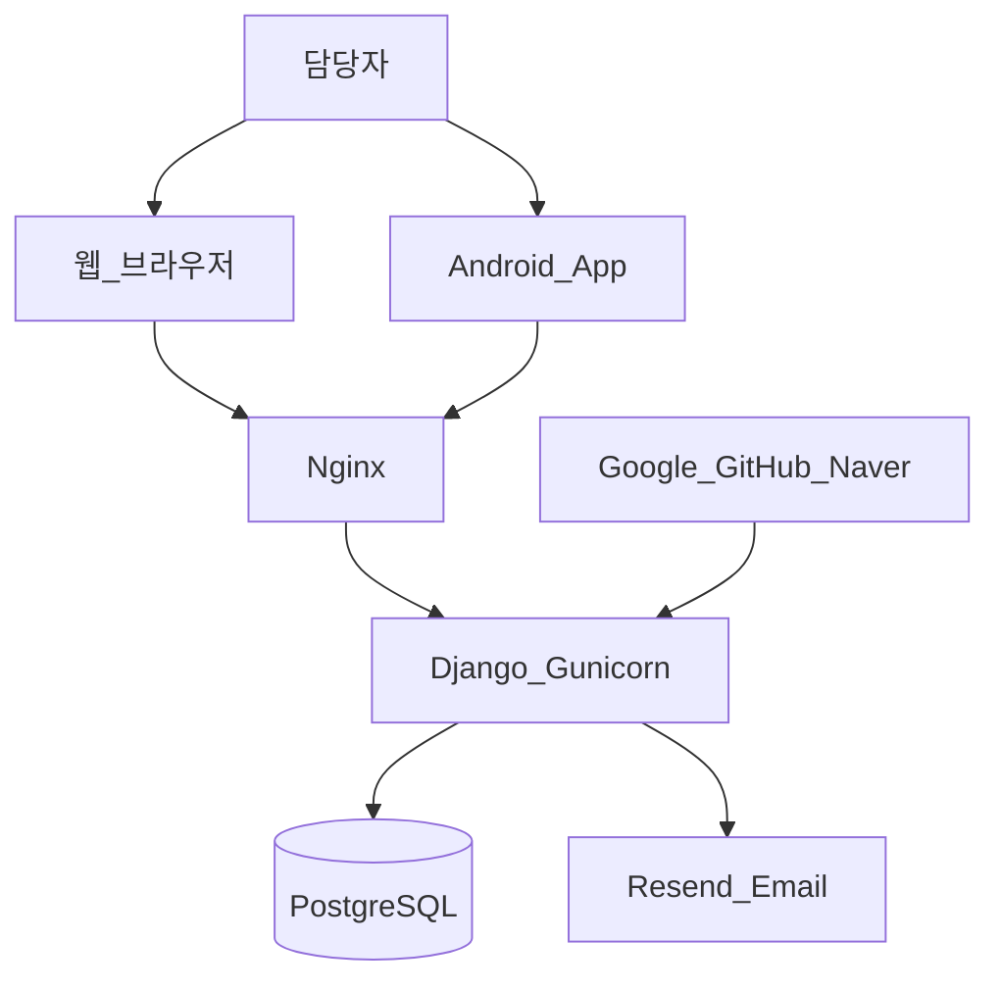
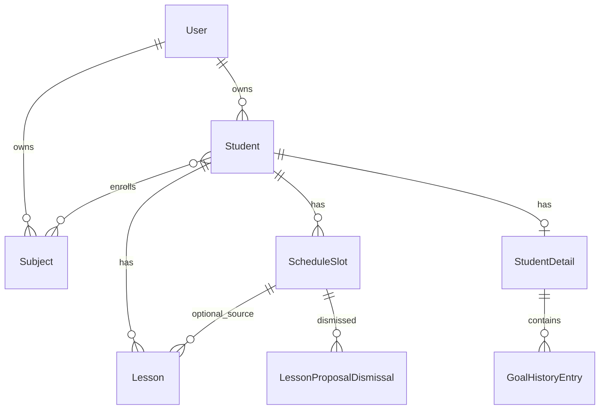

# 시스템 사양서 (System Specification)

| 항목 | 내용 |
|------|------|
| 프로젝트명 | tutoring-manager (과외 관리) |
| 문서 버전 | 1.0 |
| 작성일 | 2026-05-22 |
| 상태 | 확정 명세 기반 |
| 기능 요구 | [기능요구서.md](./기능요구서.md) |

---

## 1. 문서 목적

본 문서는 tutoring-manager의 **시스템 구조·기술 스택·데이터 모델·인터페이스·배포·보안** 등 구현 및 운영에 필요한 **기술 사양**을 정의한다.

---

## 2. 시스템 컨텍스트



| 구성요소 | 설명 |
|----------|------|
| 웹 클라이언트 | Django SSR 템플릿 + JS(FullCalendar 등) |
| Android 클라이언트 | Kotlin, Jetpack Compose, Retrofit |
| 애플리케이션 서버 | Django 4.x/5.x + Gunicorn (컨테이너) |
| DB | PostgreSQL 16 |
| 리버스 프록시 | Nginx (TLS 종료, 정적·미디어) |
| 메일 | Resend (anymail), 개발 시 console/Mailpit |

---

## 3. 아키텍처 원칙

| 원칙 | 내용 |
|------|------|
| **Dual client** | 웹 = 세션·SSR; 모바일 = JWT·REST. 도메인 로직 공유 |
| **Single tenant per user** | 모든 비즈니스 데이터는 `owner = request.user` |
| **Lesson on demand** | 미래 `Lesson` row 선생성 없음. 제안은 계산값 |
| **Timezone per student** | 저장: IANA string. API·DB datetime: UTC |
| **Config in container** | 호스트 OS env 미사용. compose → 컨테이너 env |

---

## 4. 기술 스택

### 4.1 서버

| 계층 | 기술 |
|------|------|
| 언어 | Python 3.11+ |
| 프레임워크 | Django |
| ORM | Django ORM → PostgreSQL |
| 웹 UI | Django Templates, FullCalendar(달력) |
| API | Django REST Framework, djangorestframework-simplejwt |
| 인증(웹) | django-allauth, django-axes, django-otp |
| 메일 | django-anymail[resend] |
| WSGI | Gunicorn |
| 컨테이너 | Docker, docker compose |

### 4.2 클라이언트

| 클라이언트 | 기술 |
|------------|------|
| 웹 | HTML, CSS, JS (HTMX 선택 가능, 1차 미확정) |
| Android | Kotlin, Jetpack Compose, Material 3, Hilt, Retrofit, kotlinx.serialization, DataStore |

### 4.3 호스팅

| 항목 | 사양 |
|------|------|
| OS | Ubuntu (게인 서버) |
| DB 모드 | `DB_BACKEND=embedded` \| `external` |
| 영속화 | `./data/postgres`, `./data/media` bind mount |

*상세: [infrastructure.md](./infrastructure.md)*

---

## 5. 애플리케이션 구조 (서버)

```
tutoring-manager/
  manage.py
  config/                 # settings, urls, wsgi
  accounts/               # User, 2FA, security
  students/               # Student, Subject, ScheduleSlot, Detail, History
  calendar/               # Lesson, ProposalDismissal, services
  api/                    # DRF v1 (auth, viewsets)
  deploy/
    Dockerfile.app
    Dockerfile.postgres
    docker-compose.yml
    nginx/
  android/                # Kotlin project (별도 Gradle)
  data/                   # gitignore — postgres, media
```

---

## 6. 데이터 모델

### 6.1 ER 개요



### 6.2 주요 엔티티

#### `accounts.User`

| 필드 | 타입 | 제약 |
|------|------|------|
| `email` | EmailField | unique, `USERNAME_FIELD` |
| `password` | | Argon2 |

#### `Student`

| 필드 | 타입 | 비고 |
|------|------|------|
| `owner` | FK User | CASCADE |
| `name` | CharField | required |
| `birth_year` | PositiveIntegerField | |
| `grade` | CharField(32) | 자유 입력 |
| `country`, `city` | CharField | |
| `timezone` | CharField | IANA |
| `student_contact`, `parent_name`, `parent_contact` | CharField | |
| `hourly_rate` | DecimalField | KRW 가정 |
| `lesson_duration_minutes` | PositiveSmallIntegerField | |
| `lessons_completed` | PositiveIntegerField | default 0 |
| M2M | `subjects` → Subject | |

**계산**: `age = current_year - birth_year`, `next_lesson_number = lessons_completed + 1` (비저장)

#### `ScheduleSlot`

| 필드 | 타입 |
|------|------|
| `student` | FK Student |
| `day_of_week` | 0=일 … 6=토 |
| `start_time`, `end_time` | TimeField |
| `note` | CharField blank |

#### `Lesson`

| 필드 | 타입 | 비고 |
|------|------|------|
| `student` | FK | |
| `schedule_slot` | FK null | |
| `date` | DateField | 학생 TZ 기준 날짜 |
| `start_datetime`, `end_datetime` | DateTimeField | UTC |
| `lesson_number` | PositiveIntegerField | 생성 시 고정 |
| `status` | enum | scheduled, completed, cancelled |
| `completed_at` | DateTimeField null | |
| `lesson_content`, `lesson_notes` | TextField blank | |
| `lesson_kind` | enum | regular, test |
| `course_name` | CharField blank | |
| `cancelled_by` | enum null | student, teacher |
| `cancel_reason` | CharField blank | |
| `makeup_status` | enum | undecided, no_makeup, scheduled |
| `makeup_date` | DateField null | |

**종료 시각**: `end_datetime = start_datetime + timedelta(minutes=student.lesson_duration_minutes)`

#### `LessonProposalDismissal`

| 필드 | 제약 |
|------|------|
| `schedule_slot`, `date`, `owner` | unique_together |

#### `StudentDetail` / `GoalHistoryEntry`

*상세: [students.md](./students.md)*

### 6.3 인덱스·쿼리 (권장)

- `Lesson`: `(student_id, start_datetime)`, `(student_id, status, date)`
- `Student`: `(owner_id, name)`, `(owner_id, grade)`
- Calendar events: `start`~`end` 구간 + `owner` 필터

---

## 7. 비즈니스 로직 사양

### 7.1 제안(Proposed) 계산

입력: `owner`, calendar `[start, end]`

1. 구간 내 각 `date` × `ScheduleSlot` where `date.weekday == slot.day_of_week`
2. `LessonProposalDismissal` 없음
3. 동일 `(slot, date)`에 `Lesson` 없음
4. → proposed 이벤트 반환 (`proposed: true`)

### 7.2 Materialize (자동 생성)

- 조건: proposed 이벤트且 `start_datetime <= now` (또는 사용자 ✓)
- 동작: `Lesson` INSERT, `lesson_number = student.lessons_completed + 1`

### 7.3 완료

- `status → completed`, `completed_at = now`
- `student.lessons_completed += 1` (idempotent flag on lesson 권장)

### 7.4 충돌(Conflict)

- 동일 담당자·겹치는 `[start, end)` 구간 `Lesson` 쌍 탐지 → `conflicts[]`

### 7.5 주간 현황

- 필터: ISO `(iso_year, iso_week)` → `[week_start Monday, week_end Sunday]`
- `status in (completed, cancelled)`, `start_datetime` date in range
- 특이사항·60분 하이라이트: [weekly-lesson-status.md](./weekly-lesson-status.md) 포맷터

### 7.6 ISO 주차

```python
# iso_year, iso_week → week_start (Mon), week_end (Sun)
# date.isocalendar(); 1월 4일 ∈ 1주차
```

---

## 8. 인터페이스 사양

### 8.1 웹 URL (주요)

| Method | Path | 설명 |
|--------|------|------|
| GET | `/` | 홈 달력 |
| * | `/accounts/*` | allauth |
| GET/POST | `/students/` | 목록 |
| GET/POST | `/students/new/`, `/students/<id>/edit/` | 폼 |
| GET | `/students/<id>/` | 상세 |
| GET | `/students/<id>/progress/` | 학생별 진도차트 |
| GET | `/students/progress/` | 진도 허브 |
| GET/POST | `/students/progress/import/` | 진도차트 `.xls` 업로드 |
| GET | `/students/progress/import/review/` | 가져오기 검토·카드별 적용 |
| POST | `/students/progress/import/apply/` | 가져오기 단건 DB 저장 (JSON) |
| GET | `/students/progress/import/template/` | `진도차트.xls` 템플릿 다운로드 |
| GET | `/students/new/?from_progress_import=1` | 엑셀 메타로 학생 등록 폼 prefill (세션 draft 필요) |
| GET | `/reports/weekly/` | 주간 현황 |
| GET/POST | `/settings/subjects/` | 과목 |

### 8.2 REST API

- Base: `/api/v1/`
- 인증: `Authorization: Bearer <access>`
- 전체 목록: [api.md](./api.md)

| 그룹 | 대표 엔드포인트 |
|------|-----------------|
| Auth | `POST /auth/token/`, `POST /auth/token/refresh/` |
| Students | `GET/POST /students/`, `GET/PATCH /students/{id}/` |
| Calendar | `GET /calendar/events/?start=&end=` |
| Lessons | `POST /lessons/`, `POST /lessons/{id}/complete/`, `POST .../cancel/`, `PATCH ...` |
| Reports | `GET /reports/weekly/?year=&week=` |

### 8.3 Android 화면·API 매핑

| 화면 | API |
|------|-----|
| Login | `POST /auth/token/` |
| StudentList | `GET /students/` |
| Calendar | `GET /calendar/events/` |
| Complete | `POST /lessons/{id}/complete/` |
| Weekly | `GET /reports/weekly/`, `GET /reports/weekly/weeks/` |

*상세: [mobile-android.md](./mobile-android.md)*

---

## 9. 인증·보안 사양

### 9.1 웹

| 항목 | 사양 |
|------|------|
| 세션 | Django session, `SESSION_COOKIE_SECURE` (HTTPS) |
| CSRF | 폼·AJAX `X-CSRFToken` |
| 비밀번호 | Argon2 |
| 잠금 | django-axes |
| MFA | django-otp TOTP — 민감 작업만 |

### 9.2 API / Android

| 항목 | 사양 |
|------|------|
| Access JWT | 만료 15분 (권장) |
| Refresh | 7일, rotation 선택 |
| 저장 | DataStore / Encrypted 권장 |
| 미인증 이메일 | 403 `email_not_verified` |

### 9.3 OAuth (웹)

- Providers: Google, GitHub, Naver
- Redirect: allauth 기본 + `DOMAIN` 기반 `ALLOWED_HOSTS` / CSRF

### 9.4 배포 보안

| `DOMAIN` | Nginx bind | Django |
|----------|------------|--------|
| `""` / `local` | `127.0.0.1:8080` | localhost only |
| FQDN | `0.0.0.0:443` | `ALLOWED_HOSTS=[DOMAIN]`, secure cookies |

---

## 10. UI·표시 사양 (웹 달력)

| `ui_state` | 조건 | 표시 |
|------------|------|------|
| `upcoming` | now < start, scheduled | 예정 색 |
| `in_progress` | start ≤ now < end | 수업중 |
| `past_incomplete` | now ≥ end, not completed | 지남 |
| `completed` | status=completed | 완료 |
| `cancelled` | status=cancelled | 취소선·회색 |
| `proposed` | virtual | 흐린 회색, ✓/✗ |

---

## 11. 환경 변수 (필수)

| 변수 | 용도 |
|------|------|
| `SECRET_KEY` | Django |
| `DB_BACKEND`, `DB_HOST`, `DB_PORT`, `DB_NAME`, `DB_USER`, `DB_PASSWORD` | DB |
| `DOMAIN` | localhost vs public |
| `RESEND_API_KEY`, `DEFAULT_FROM_EMAIL` | 운영 메일 |
| `GOOGLE_*`, `GITHUB_*`, `NAVER_*` | OAuth |
| `POSTGRES_*` | embedded DB 컨테이너 |

누락 시: compose `${VAR:?}` + entrypoint 검증 → **기동 실패**

---

## 12. Docker·배포 사양

| 이미지 | 역할 |
|--------|------|
| `tutoring-app` | Django only |
| `tutoring-postgres` | PG16, embedded only |
| `nginx:alpine` | 프록시 |

```bash
# external
DB_BACKEND=external docker compose up -d

# embedded
DB_BACKEND=embedded docker compose --profile embedded up -d
```

- **자동 pg_dump 없음** — 호스트 `data/postgres` 백업은 운영자 책임

---

## 13. 외부 연동

| 서비스 | 용도 | 문서 |
|--------|------|------|
| Resend | 인증·알림 메일 | [auth.md](./auth.md), [email-deliverability.md](./email-deliverability.md) |
| Google/GitHub/Naver OAuth | 소셜 로그인(웹) | [auth.md](./auth.md) |

---

## 14. 제약·가정

- 단일 담당자 계정이 자신의 학생만 관리 (B2B 학원 멀티 강사 1차 미지원)
- 동시 편집 충돌 해결(optimistic lock) 1차 미정 — last write wins
- 미디어·첨부 저장소 1차 미사용
- API rate limit 1차 미적용

---

## 15. 테스트·검수 기준 (권장)

| 영역 | 기준 |
|------|------|
| 단위 | proposed/conflicts/ISO week/remarks formatter |
| 통합 | owner 격리, complete → lessons_completed |
| API | JWT, 401 refresh, calendar events schema |
| E2E | 웹 로그인 → 학생 등록 → 제안 승인 → 완료 → 주간 현황 |
| Android | 로그인 → 목록 → 달력 → 완료 스모크 |

---

## 16. 문서 참조 매트릭스

| 사양 영역 | 문서 |
|-----------|------|
| 기능 ID | [기능요구서.md](./기능요구서.md) |
| 인증 | [auth.md](./auth.md) |
| 학생 | [students.md](./students.md) |
| 달력 | [calendar.md](./calendar.md) |
| 진도 | [progress-chart.md](./progress-chart.md), [progress-import.md](./progress-import.md) |
| 주간 | [weekly-lesson-status.md](./weekly-lesson-status.md) |
| API | [api.md](./api.md) |
| Android | [mobile-android.md](./mobile-android.md) |
| 인프라 | [infrastructure.md](./infrastructure.md) |

---

## 17. 개정 이력

| 버전 | 일자 | 변경 |
|------|------|------|
| 1.0 | 2026-05-22 | 초판 — 확정 도메인 명세 통합 |
| 1.1 | 2026-05-22 | 진도차트 `.xls` 가져오기 URL·학생 등록 prefill |
